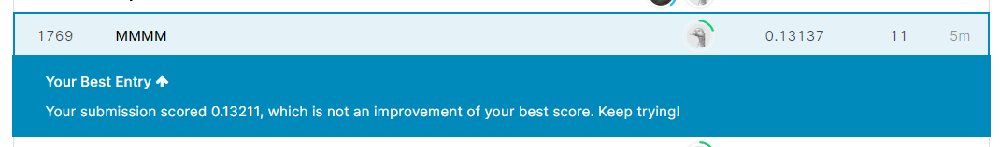
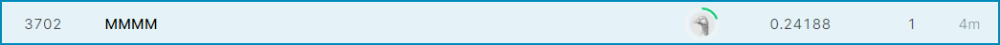

\newpage

```{r setup, include=FALSE}
knitr::opts_chunk$set(echo = FALSE)
library(tidyverse)
library(caret)
library(ggthemes)

d1 <- read_csv("train.csv")
```

##Instructions (from canvas/grading rubric) -- REMOVE BEFORE SUBMITTING
Length. No more than 5 pages of text, single spaced, excluding plots and tables. (Submit source code in a separate document.) As noted above, you may write less than 5 pages, provided that you satisfy the requirements for the project. Check the grading rubric on Canvas for specific grading criteria.

Report Format. Your final report should be written and formatted carefully. Consider your audience to be, hypothetically, the manager of a data science team. You should observe the best practices of statistical communication: use graphs when possible, labeling and explaining them, and interpret statistical results using language and quantities that non-statisticians can understand. (Remember: your results could get recycled for non-expert audiences.) Your report should: (1) introduce the problem, (2) describe the data and any cleaning you did, (3) explain your model in detail (how you developed it, and how it differs from and improves upon the model you used for the interim report), and (4) report model performance, including:

RMSE and R2 on the train set.
Estimated RMSE and R2 on the test set.
Your best Kaggle score (log RMSE) and rank.

Are your figures labelled clearly, accompanied by explanatory captions, and referenced in the text? Likewise, are your tables titled and/or captioned appropriately and referenced in the text? Do the figures and tables chosen improve communication or are they superfluous?

Are you writing in full sentences? Are there many gram- matical or spelling errors? Are you using the .Rmd or .Rnw formats correctly so that your final document is attractively formatted? Does the report look sharp, or are there issues with the compile from .Rmd such that there is lots of junk code getting printed to the screen?


## Introduction
Introduction. What is the problem you are working on? Briefly but thoroughly describe the Kaggle train/test format, and your ultimate objective in the project.

Unlike other products, perhaps two houses can have the same valuation, it is impossible to find two identical homes in the world. There are so many factors that can affect price of houses regardless the cities or countries. Often times homebuyers and real estate companies would come across with a question to consider, "what factors tend to have greater influence on prices?" With the sample training dataset of home prices in Ames, Iowa, there are 80 variables of 1459 homes shown, along with the sales price of each home. That information becomes critical to analyze to find out which are the top factors/predictors of home sales price. After analyzing of the training dataset, we will predict the home prices of 1459 houses in the testing dataset, based on their features. The purpose of this practice is to discover the pattern and build the model to predict home sales prices in the test dataset with the highest accuracy possible. 

## Data modeling and cleaning
Data modeling and Cleaning. What sort of data modeling and cleaning decisions did you make? Did you create any variables? Did you refactor any variables? How did you deal with NAs?

We started with understanding the meaning of the values in all the columns. Some of the numeric variables are straightforward and easy to interpret, such as square feet, number of baths and year. However, we noticed that some numeric values have ambiguous meaning  (i.e. MSSubClass and MoSold) and are actually categorical. Therefore, we converted them into factors so that they make more sense. We also created a new column called Age which is the difference between YrSold and YearRemodAdd.
Further data cleaning was necessary before we could do the analysis. There were missing values in some categorical variables, shown as NAs. However, the true meaning of these NAs was that the house did not have such a facility or attribute. For example, having NA in the column ‘Alley’ meant there’s no alley in the house instead of missing data value. To solve the potential confusion from the dataset, we replaced the NAs with ‘none’ 
There were also NAs in several columns of numeric variables that required some cleaning work. Instead of missing values, many of the NAs in numeric variable columns mean 0 (zero). For the data cleaning process, we replaced some NAs with 0 and some with the median of the whole column, depending on the variables. 

Before performing modeling analysis, we also changed all the non-numeric variables into factors to make the dataset more user-friendly. We applied the changes mentioned above into both the training and testing dataset.
There were also some variables (after changing to factors) that did not align in the train and test dataset. We also overwrote the factor level formats of the testing data with the training data’s factor levels. For both training and testing dataset, we manually set the factor levels specifically for the following variables: utilities, KitchenQual and Exterior2nd. 

## Model and model development
Model and Model development. Describe your model. Which variables did you end up using in your model, and why? Which statistical method(s) did you choose and why?

We initially started with a basic linear regression for SalePrice against the cleaned up data for all variables and it had a Kaggle score  of .18. While this was an improvement over the .24 score from our previous five factor model, we started experimenting with various ideas to improve our model.  

The next step involved switching to a linear regression using a log transformed SalePrice as the target variable.  This was done since the data for SalePrice was skewed to the right and included several large outliers:
```{r}
ggplot(d1,aes(SalePrice))+
  geom_histogram() +
  labs(title = "Initial SalePrice Distribution") +
  scale_x_continuous(labels=scales::dollar_format()) +
  theme_void()


```
However the distribution for log(SalePrice) looked a lot better:
```{r}
ggplot(d1,aes(log(SalePrice)))+
  geom_histogram() +
  labs(title = "log(SalePrice) Distribution")+
    theme_void()


```
Using log(SalePrice) as the target variable in a linear regression with all variables further improved the model to a Kaggle score of .15.   

(this could go in the section up above as well) We then created histograms and log transformed variables where they appeared to be skewed to the right with outliers.  We also plotted continuous variables in a scatter plot with SalesPrice to determine if any of those variables could be improved with a log function.  The charts highlighted a few fields that would benefit from a log transformation: LotArea, TotalBsmtSF, GrLivArea.  Making this changes didn't have a significant effect on the RMSE.  

We also noticed that the out of sample R^2^ was around .1 lower than the in sample R^2^ indicating that our model was over-fitting.  We then began experimenting with other data models that might offer better results.  Using caret's random forest model ("rf") in conjunction with log(SalePrice) returned favorable RMSE and R^2^ values and a Kaggle Score of .14. 

We then decided to try to work some interaction effects into our model.  First we used dummyVars to transform all the variables into dummy variables. This resulted in the variable count increasing to almost 200 variables.  After that we used dummyVars again to run two-way interactions on all the variables.  This inturn resulted in over 37,000 variables.  We attempted to run this through a simple lm model but continued to get stack overflow errors presumbably due to the sheer volume of variables.  


We then came across the idea of averaging results from multiple models together.  The thinking was that each model utilizes different methods to drive its predictions and a combination of models could result in a better prediction than the sum of its parts.  This would be similar to how holding uncorrelated assets in an investment portfolio, while individually are risky, can increase returns while lowering risk.  To this end we averaged our random forest model with our linear regression model.  These two models had respective Kaggle scores of .14 and .15, however when we averaged them together the resulting output obtained a Kaggle score of .13.  We experimented with various weightings between the two models and found that a 60/40 blend of rf and lm produced the lowest kaggle score.  

## Model performance
Calculating RMSE and R2 on the random forest and combined model proved to be a bit tricky.  We ultimately ended up regression our predictions against the actual train SalePrice values and then using those to report an RMSE that reflected the hybrid randomforest/linear components of the model.  To that end we estimated the following performance fore in and out of sample.

In Sample
* RMSE = 11460
* R^2^ = 0.9792

Out of Sample
* RMSE = 11681.82
* R^2^ = 0.9776433

Based on the out of sample RMSE and R^2^ being relatively close to the in sample figures, we believe that our model does not suffer from overfitting and will perform well with new test data.

Our final Kaggle submission score is .13137.


## Leaderboard
Our hybrid model earned a rank of 1769 on the global leaderboard:

This is a significant upgrade from our interim report a month ago which had a rank of 3702:



