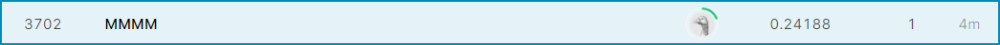

```{r setup, include=FALSE}
knitr::opts_chunk$set(echo = FALSE)
library(tidyverse)
```

```{r}
### Requirements for Interim report
    
#- Length: No more than 1 page, single spaced, including graphs and tables.
#- Benchmark performance:  minimum in-sample R2 for this model is .75. Please keep experimenting with models until you have #reached that benchmark.
#- Your 1 page interim report should (1) introduce the problem, (2) describe your model, and (3) report model performance, including: 

#    + RMSE and R2 on the train set
 #   + Estimated RMSE and R2 on the test set. (It is fine to report log RMSE.)
  #  + Your Kaggle score (returned log RMSE) and rank.

```
### Problem introduction
There are so many factors that can affect price of houses regardles the cities or countries. Often times homebuyers and real estate companies would come across with a question to consider, "what factors tend to have greater influence on prices?" With the sample training dataset of home prices in Ames, Iowa, there are 80 variables of 1459 homes shown, along with the sales price of each home. That information becomes critical to analyze to find out which are the top factors/predictors of home sales price. After analyzing of the training dataset, we will predict the home prices of 1459 houses in the testing dataset, based on their features. The purpose of this practice is to discover the pattern and build the model to predict home sales prices with the highest accuracy possible. 

### Model Description
We created a model that predicts the sales price of a home based on its characteristics.  We used our domain knowledge of real estate prices to identify the variables that we believe would be good predictors of the SalesPrice target variable. After trying out various combinations the regression with the best performance included these five fields:

Neighborhood + YearBuilt + FirstFlrSF + SecondFlrSF + GarageArea 


### Model Performance 

* train R^2: 0.7766
* train RMSE: 37920
* estimated test R^2 (10-fold cross-validation via caret): 0.7582
* estimated test RMSE (10-fold cross-validation via caret): 39135.43 
* Kaggle Score:0.24
* Kaggle Ranking: 3702



### Plots
```{r}


```
